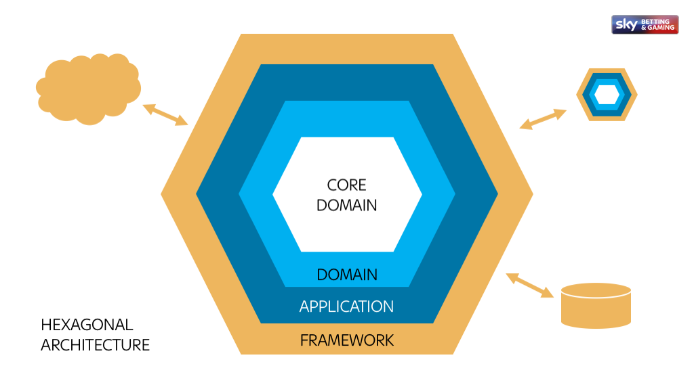
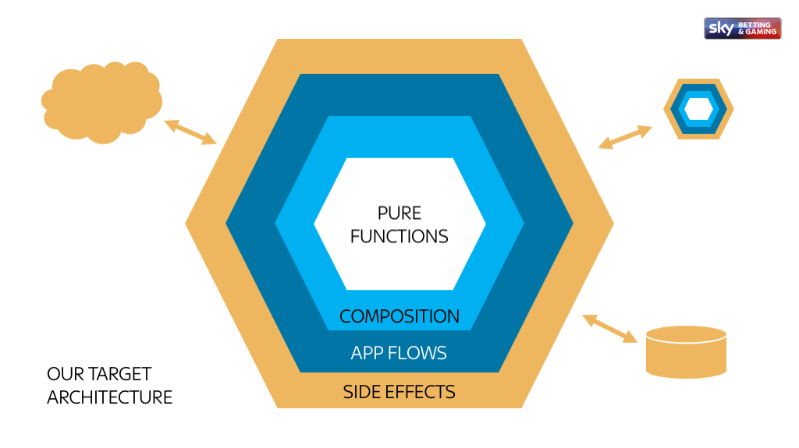

# A Simple Application

So, we've done some basic work on writing functional JavaScript but it's still very academic. Let's get started on our path to writing production applications by tackling the world's most favourite programming problem - how to get "Hello World" over HTTP.

But first we'll have a quick look at the sort of software architecture we're going to be implementing.

## Application Design Patterns

We will aim to build our applications in a way which allows us to use them in a multitude of different situations, independently of the access layer (i.e. HTTP, AMQP, Websocket, admin script, etc.)

> By separating the software into layers, and conforming to The Dependency Rule, you will create a system that is intrinsically testable, with all the benefits that implies. When any of the external parts of the system become obsolete, like the database, or the web framework, you can replace those obsolete elements with a minimum of fuss.

One example of this separation of concerns is the hexagonal architecture (shown below). 



To explain some of the terms used:

* Domain – business logic layer exposed via function interface
* Application – Orchestrates communication between Framework and Domain
* Framework – Elements (like libraries etc.) that are used by the Application but which aren’t built or owned by you

This does a pretty good job of showing how a traditional MVC application may consider splitting itself up to fit this "clean architecture" style thinking. It doesn't, however, map neatly with some of the other ideas presented as part of this workshop so I've tweaked it slightly to better fit how I view this concept related to functional programming principles.



## Exercises

1.  Build a basic micro service which returns "Hello World" as the response for any request to localhost:8000
1.  Change the response from a string to a JavaScript object
1.  Add a rule which responds with a 404 when the browser requests `/favicon.ico`
1.  Add unit test(s) to validate the service is working as expected

Example JSON response:

```JSON
{
  "success": true,
  "message": "Hello World"
}
```

## Further Reading

* [The Clean Architecture](https://8thlight.com/blog/uncle-bob/2012/08/13/the-clean-architecture.html)
* [Hexagonal Architecture](http://fideloper.com/hexagonal-architecture)
* [Micro](https://npmjs.com/package/micro)
* [Handling setup in micro applications](https://zeit.co/blog/micro-9-1)
* [test-listen](https://npmjs.com/package/test-listen)
* [Now](https://zeit.co/now)


Next - [a more realistic application](./a-more-realistic-application.md)
