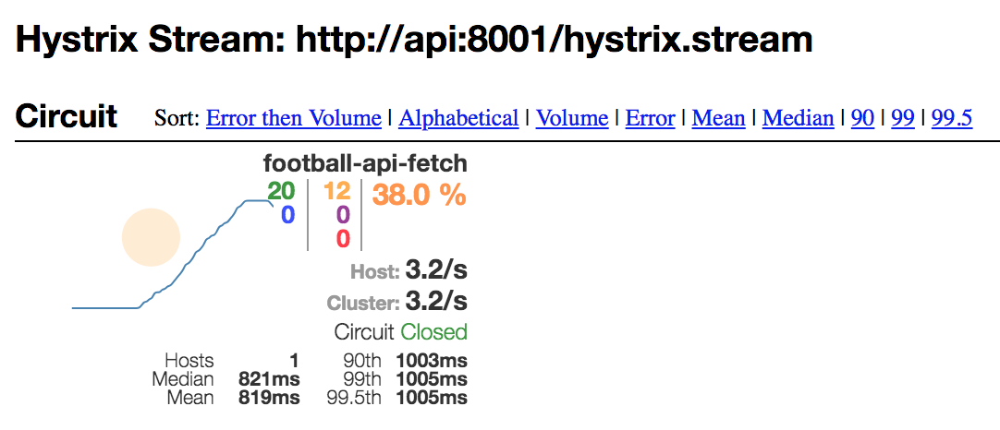

# Circuit Breaker

> Circuit breakers are effective at guarding against integration points, cascading failures, unbalanced capacities, and slow responses.

The circuit breaker pattern is of critical importance when building resilient services, especially if you are working in a microservice architecture. Unfortunately for us, they're not completely in line with the principals of pure functional programing we've come to know and love.

For a circuit breaker to be effective, it has to maintain some concept of state. It would be pointless putting a new breaker around each independent call to a service as it's the ability to analyse the overall state of requests that makes this pattern so valuable.

Luckily, we're working with JavaScript and while we're certainly not going to abandon all we've learnt about FP, there's a pragmatic way to introduce this pattern whilst avoiding unecessary contortion or stress.

> As with the prometheus client, this is another example where using an open-source solution which doesn't implement concepts from functional programming/the fantasyland-spec is the best way to work. There's a lot involved in creating the circuit breaker implementation and, as you read shortly, having the ability to integrate with Hystrix Dashboard out of the box is a big win.

## Configuring Brakes

The [module readme](https://npmjs.com/package/brakes) contains lots of detail around configuration so this section will be short. The main thing to remember is to create your breaker with a unique name and to set a timeout appropriate to your use-case.

More advanced usage can include fallback functions and child circuits - these aren't topics we're going to cover in this workshop.

```JavaScript
// This is an exampe of wrapping the fetch API
const Brakes = require('brakes');

// Wrap the function you want to protect
const fetchBreaker = new Brakes(fetch, {
  timeout: 1000,
  name: "My Circuit Breaker"
});

// Use your circuit breaker as follows
fetchBreaker
  .exec("https://status-code-checker.now.sh") // pass parameters the original function is expecting
  .then(res => console.log("success", res)) // Called if underlying service is healthy
  .catch(err => console.error("error", err)); // Called on timeout, failure or circuit is open
```

## Observing The State Of Circuit Breakers

We are using the library `brakes` which allows us to expose the status of our circuit breaker(s) in a format which can be consumed by the hystrix-dashboard. This dashboard allows us to see the volume of requests being made through our circuit breaker and the current state of the circuit. 

To make this stream of data available, we can add some lightweight code to our api:

```JavaScript
// ensure Brakes has been required into the module
if (reqUrl.pathname === '/hystrix.stream') {
    res.setHeader('Content-Type', 'text/event-stream;charset=UTF-8');
    res.setHeader(
      'Cache-Control',
      'no-cache; no-store; max-age=0; must-revalidate'
    );
    res.setHeader('Pragma', 'no-cache');
    return Brakes.getGlobalStats().getHystrixStream();
}
```

At this point in the workshop you do not need to set up and run the Hystrix dashboard, but it's good to know that you have the ability to peak into the inner workings of the circuit breaker.



## Modelling Failure Locally

tl;dr Use toxiproxy and inject failure to watch things crumble (or not, after all, you're implementing the Circuit Breaker pattern!)

## Exercises

1. Using the `httpClient` you wrote in the [first part of the workshop](./fp-js.md), create a new version of the client which includes a circuit breaker
1. Update your world cup fixtures application to use your newly created circuit breaker version of httpClient
1. Test your circuit breaker using toxiproxy and siege - how does your application's response change over time?

## Help

Some useful toxiproxy commands:

```bash
# start the server
toxiproxy-server

# in a new terminal
toxiproxy-cli create "footy-api" --listen localhost:8080 --upstream api.football-data.org:80

# add some failure!
toxiproxy-cli toxic add footy-api --type timeout -n down -a timeout=2000
```

## Further Reading

* [Hystrix](https://github.com/Netflix/Hystrix)
* [Hystrix Dashboard](https://github.com/Netflix-Skunkworks/hystrix-dashboard/wiki)
* [Release It!](https://pragprog.com/book/mnee2/release-it-second-edition)
* [Circuit Breaker](https://martinfowler.com/bliki/CircuitBreaker.html)
* [Brakes](https://npmjs.com/package/brakes)
* [Toxiproxy](https://github.com/Shopify/toxiproxy)
* [Siege](https://www.joedog.org/siege-manual/)
* [Load Testing Web Servers With Siege](https://www.linode.com/docs/tools-reference/tools/load-testing-with-siege/)

Next - [docker](./docker.md)
