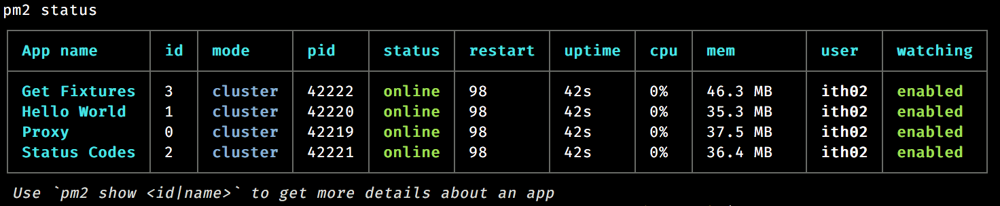

# Process Management

> Execute the app as one or more stateless processes


This is possibly the biggest minefield as *every* company and/or project will likely have some customised or unique way of deploying software. This workshop presents an opinionated way of working to provide features such as:

* horizontal scaling of processes locally to replicate a live environment
* configuration injected via environment variables
* auto-restart of applications on code changes
* process independence to allow for deployment via docker
* ability to build ecosystem of applications and backing services using `docker-compose` (advanced!)
* ability to have a proxy which maps paths to applications (if this isn't clear, see the blog from Zeit [Simplifying Microservices with Path Aliases](https://zeit.co/docs/features/path-aliases))

To achieve this, we're going to use a couple of different tools (some clues from the list above):

1. PM2 - a process manager which allows us to define services in a json config file
2. docker (and docker-compose) - this allows us to build images which can be run in various container platforms

## PM2

PM2 is process manager which can be used in development and production environments (and also in containers - have a look through the workshop code to see how that works) and offers us a nice way of working with microservice/function-as-a-service style node.js apps.

Covering PM2 in great depth would take way longer than the time allocated for this workshop (so go read the docs!) but, in a nutshell, with some basic configuration in place we can get horizontally scaled processed and restart on file change functionally with very little effort. (More information on how to use PM2 with docker is [available on the PM2 website](http://pm2.keymetrics.io/docs/usage/docker-pm2-nodejs/))

### Useful commands

```bash
pm2 start config.js # Bring up your apps as defined in the config file

pm2 status # see a snapshot of the status of your apps

pm2 logs # tail the stream of logs produced by all apps (this can be filtered to individual apps)

pm2 monit # open a dashboard showing the current state of all apps being managed by pm2
```



## Docker Compose
 
> Twelve-factor processes are stateless and share-nothing. Any data that needs to persist must be stored in a stateful backing service, typically a database.

`docker-compose` gives us an elegant way to set up our full environment for development, including backing services. Again, there are many ways for us to work with docker and docker-compose and the workshop uses these tools to build on top of the features offered by pm2, rather than replace it.

For now, we'll ignore the docker-compose aspects of this project and will hopefully come back to them after we've explored metrics and circuit-breakers.

## Exercises

1. Create a `services.config.js` file at the root of your project define an app to run your "hello world" service ([pm2's process file documentation will help](http://pm2.keymetrics.io/docs/usage/application-declaration/))
2. Play with scaling the application to multiple instances
3. Add the world cup fixtures app to your `services.config.js` file and try to start it up. What happens?

## Further Reading

* [Docker](https://www.docker.com/)
* [`docker-compose`](https://docs.docker.com/compose/)
* [Kubernetes](https://kubernetes.io/)
* [PM2](http://pm2.keymetrics.io/)
* [Now](https://zeit.co/now)
